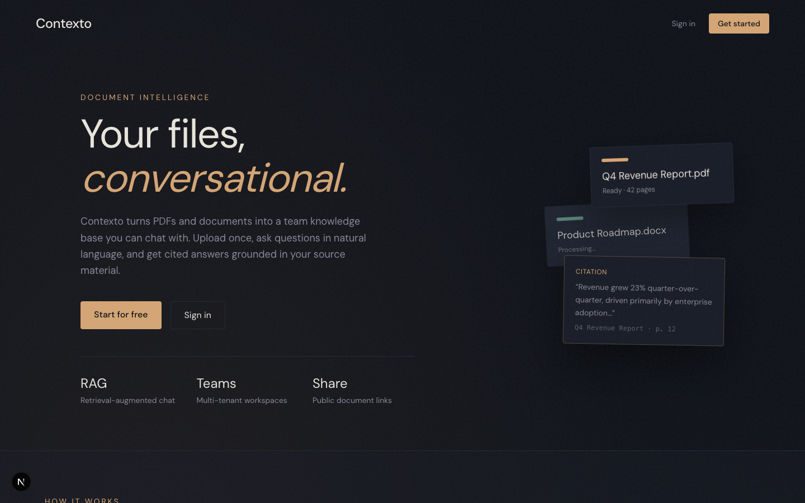
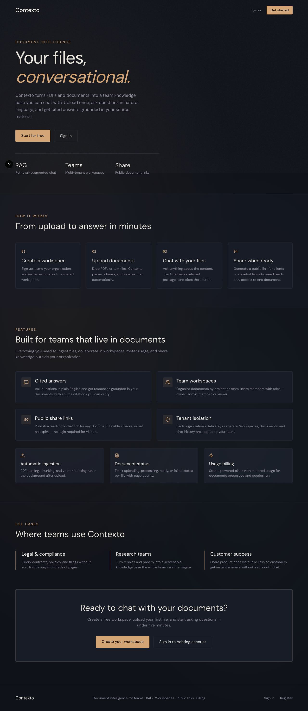

# Contexto

**Your files, conversational.**

Contexto is an AI document intelligence platform for teams. Upload PDFs and documents into shared workspaces, ask questions in natural language, and get cited answers grounded in your source material.

> **RAG** · Retrieval-augmented chat &nbsp;|&nbsp; **Teams** · Multi-tenant workspaces &nbsp;|&nbsp; **Share** · Public document links

## Website

Landing page (when running `npm run dev:frontend`).



<details>
<summary>Full landing page screenshot</summary>



</details>

<details>
<summary>Upload document (in workspace)</summary>


</details>

---

## Overview

Contexto turns PDFs and documents into a team knowledge base you can chat with. Upload once, ask questions in natural language, and get cited answers grounded in your source material.

Teams collaborate in workspaces, pay based on usage through Stripe, and can publish any document behind a shareable public link — no login required for visitors.

---

## How it works

| Step | Title | Description |
| --- | --- | --- |
| **01** | Create a workspace | Sign up, name your organization, and invite teammates to a shared workspace. |
| **02** | Upload documents | Drop PDFs or text files. Contexto parses, chunks, and indexes them automatically. |
| **03** | Chat with your files | Ask anything about the content. The AI retrieves relevant passages and cites the source. |
| **04** | Share when ready | Generate a public link for clients or stakeholders who need read-only access to one document. |

---

## Features

### Cited answers
Ask questions in plain English and get responses grounded in your documents, with source citations you can verify.

### Team workspaces
Organize documents by project or team. Invite members with roles — owner, admin, member, or viewer.

### Public share links
Publish a read-only chat link for any document. Enable, disable, or set an expiry — no login required for visitors.

### Tenant isolation
Each organization's data stays separate. Workspaces, documents, and chat history are scoped to your team.

### Automatic ingestion
PDF parsing, chunking, and vector indexing run in the background after upload.

### Document status
Track uploading, processing, ready, or failed states per file with page counts.

### Usage billing
Stripe-powered plans with metered usage for documents processed and queries run.

---

## Use cases

| Area | How Contexto helps |
| --- | --- |
| **Legal & compliance** | Query contracts, policies, and filings without scrolling through hundreds of pages. |
| **Research teams** | Turn reports and papers into a searchable knowledge base the whole team can interrogate. |
| **Customer success** | Share product docs via public links so customers get instant answers without a support ticket. |

---

## Tech stack

| Layer | Technology |
| --- | --- |
| Frontend | Next.js 15 (App Router), React, Tailwind CSS |
| Backend | NestJS 11, TypeScript |
| Database | PostgreSQL 16 |
| Vector search | pgvector (embeddings stored in PostgreSQL) |
| AI / LLM | OpenRouter (chat + embeddings) |
| Billing | Stripe |
| Auth | JWT (Passport) |
| Monorepo | Nx + npm workspaces |

---

## Repository structure

```
contexto/
├── apps/
│   ├── backend/          # NestJS API (auth, RAG, documents, billing, …)
│   └── frontend/         # Next.js app (dashboard, chat, landing page)
├── docker-compose.yml    # PostgreSQL with pgvector
├── SPEC.md               # Full product specification
├── nx.json
└── package.json
```

### Backend modules

`auth` · `users` · `organizations` · `workspaces` · `documents` · `rag` · `conversations` · `public-links` · `billing` · `llm` · `vector`

### Frontend routes

| Route | Description |
| --- | --- |
| `/` | Marketing landing page |
| `/login` · `/register` | Authentication |
| `/dashboard` | Workspace overview |
| `/workspaces/[id]` | Document list and upload |
| `/workspaces/[id]/documents/[docId]` | Document chat + public share link |
| `/workspaces/[id]/settings/*` | Members and billing |
| `/public/[slug]` | Anonymous read-only document chat |

---

## Prerequisites

- Node.js 20+
- Docker (for PostgreSQL with pgvector)

---

## Getting started

```bash
npm install
npm run docker:up
cp apps/backend/.env.example apps/backend/.env
cp apps/frontend/.env.example apps/frontend/.env.local
npm run dev
```

| Service | URL |
| --- | --- |
| **Website / Frontend** | http://localhost:3000 |
| **Backend API** | http://localhost:3001/api |
| **PostgreSQL** | localhost:5432 |

### First-time setup

1. Open http://localhost:3000 and click **Get started**.
2. Register an account and create your organization workspace.
3. Upload a PDF or text file and wait for status **Ready**.
4. Ask questions in the chat panel — answers include citations from your document.
5. Optionally create a **public share link** to let others chat without signing in.

---

## Environment variables

Configure `apps/backend/.env`:

| Variable | Description |
| --- | --- |
| `DATABASE_URL` | PostgreSQL connection string |
| `JWT_SECRET` | Secret for signing JWT tokens |
| `FRONTEND_URL` | Frontend origin (CORS) |
| `OPENROUTER_API_KEY` | OpenRouter API key |
| `OPENROUTER_CHAT_MODEL` | Chat model (e.g. `deepseek/deepseek-v4-flash`) |
| `OPENROUTER_EMBEDDING_MODEL` | Embedding model (e.g. `qwen/qwen3-embedding-8b`) |
| `EMBEDDING_DIMENSION` | Vector dimension — must match your embedding model (e.g. `4096`) |
| `STRIPE_SECRET_KEY` | Stripe secret key |
| `STRIPE_WEBHOOK_SECRET` | Stripe webhook signing secret |

---

## Commands

| Command | Description |
| --- | --- |
| `npm run dev` | Start backend + frontend in parallel |
| `npm run dev:backend` | Start NestJS API only |
| `npm run dev:frontend` | Start Next.js app only |
| `npm run build` | Build all apps |
| `npm run lint` | Lint all apps |
| `npm run test` | Run tests |
| `npm run docker:up` | Start PostgreSQL (pgvector) |
| `npm run docker:down` | Stop PostgreSQL |
| `npx nx graph` | Open project dependency graph |

### Per-project targets

```bash
npx nx serve backend
npx nx dev frontend
npx nx build backend
npx nx build frontend
```

---

## Docker

PostgreSQL runs via Docker with the **pgvector** extension enabled:

```bash
npm run docker:up
```

Defaults:

- Image: `pgvector/pgvector:pg16`
- User: `postgres`
- Password: `postgres`
- Database: `contexto`

---

## Documentation

- [Product spec](./SPEC.md)
- [Backend README](./apps/backend/README.md)
- [Frontend spec](./apps/frontend/SPEC.md)
- [Frontend design system](./apps/frontend/DESIGN.md)
- [Frontend README](./apps/frontend/README.md)

---

## License

Private — see repository for terms.
